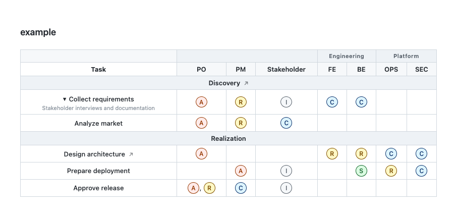

# rasci

A parser, renderer, and CLI for the **RASCI DSL**. RASCI DSL is a lightweight text format for
Responsibility Assignment Matrices. Write your RASCI matrix as plain text, render
it as HTML, Markdown, or JSON.

```rasci
rasci
  roles:
    PO  "Product Owner"
    DEV "Developer"

  tasks:
    "Implement feature":
      PO[A] DEV[R]
```

## Why

RASCI matrices are usually maintained as tables or Excel spreadsheets. These formats lack semantic
structure, are difficult to maintain, and do not integrate well with code repositories or other tools.
Treating a RASCI matrix as a data structure rather than a visual artifact allows it to be versionable,
reviewable, and renderable on demand for different contexts.

## Installation

Just clone the repository or install the package from npm locally or globally:

```shell
# locally in the project, during development
npm install
```

```shell
# globally on the system, for usage
npm install -g .
```

> [!NOTE]
> Requires Node.js ≥ 18.

## Contents

- [Why](#why)
- [Installation](#installation)
- [How](#how)
  - [Examples](#examples)
  - [Multi format example](#multi-format-example)
- [Syntax reference](#syntax-reference)
  - [Roles](#roles)
  - [Tasks](#tasks)
  - [Metadata](#metadata)
  - [Assignments](#assignments)
- [Output formats](#output-formats)
- [Web component](#web-component)
- [Live preview website](#live-preview-website)
- [RASCI legend](#rasci-legend)

## How

Install the package globally, then run the `rasci` command with an input file and options:

```bash
rasci <input.rasci> [options]
```

| Option | Description | Default |
| :--- | :--- | :--- |
| `-f, --format <html\|markdown\|json>` | Output format | `html` |
| `-o, --output <file>` | Output file | stdout |
| `-t, --title <text>` | Document title | filename without extension |
| `--no-role-groups` | Suppress role group header row | — |
| `--no-role-labels` | Suppress role name tooltips | — |
| `-h, --help` | Show help | — |

### Examples

```bash
# Render to HTML (default)
rasci matrix.rasci -o matrix.html

# Render to Markdown
rasci matrix.rasci -f markdown -o matrix.md

# Export to JSON, pipe into jq
rasci matrix.rasci -f json | jq '.matrix[] | select(.group == "Discovery")'

# Render without role group headers
rasci matrix.rasci -f html --no-role-groups -o matrix.html
```

### Multi format example

Renders `example/example.rasci` to [`example/example.html`](example/example.html), [`example/example.md`](example/example.md), and [`example/example.json`](example/example.json) for manual inspection and testing. Run from the project root:

```bash
npm run example
```

The full example from `example/example.rasci` looks like this:

```rasci
%%rasci

roles:
  PO  "Product Owner"
  PM  "Project Manager"
  "Stakeholder"
  group "Engineering":
    FE  "Frontend Engineer"
    BE  "Backend Engineer"
    group "Platform":
      OPS "Operations"
      SEC "Security"

tasks:
  group "Discovery":
    desc: "Clarify Requirements and Constraints"
    link: "https://nihilor.github.io/rasci"

    T01 "Collect requirements":
      desc: "Stakeholder interviews and documentation"
      PO[A] PM[R] FE[C] BE[C] Stakeholder[I]

    "Analyze market":
      PM[R] PO[A] Stakeholder[C]

  group "Realization":
    T02 "Design architecture":
      link: "https://github.com/nihilor/rasci"
      BE[R] FE[R] PO[A] SEC[C] OPS[C]

    T03 "Prepare deployment":
      OPS[R] BE[S] SEC[C] PM[A] Stakeholder[I]

  T04 "Approve release":
    PO[A,R] PM[C] Stakeholder[I]
```

The rendered output can look like this:



## Syntax reference

A RASCI file has two required top-level sections: `roles:` and `tasks:`.
Comments start with `%%` and are stripped before parsing.

```rasci
%%rasci

roles:
  ...

tasks:
  ...
```

Indentation is significant: **2 spaces per level**. Tabs are not supported.

### Roles

Define the columns of the matrix. Each role has an optional **alias** (short
identifier used in assignments) and a **label** (full name, shown as a tooltip).

```rasci
roles:
  PO  "Product Owner"       %% alias + label
  "Stakeholder"             %% no alias — label is used as-is
```

#### Alias rules

- Pattern: `[A-Z][A-Z0-9_]*`
- If omitted, the label string is used verbatim as the alias.
- For multi-word labels without an alias (`"Product Owner"`), the full string
  must be written in assignments (`"Product Owner"[C]`). A short alias is
  recommended for multi-word roles.

#### Role groups

Roles can be organised into named groups, which are rendered as spanning column
headers above the alias row. Groups nest arbitrarily.

```rasci
roles:
  PO  "Product Owner"
  PM  "Project Manager"
  group "Engineering":
    FE  "Frontend Engineer"
    BE  "Backend Engineer"
    group "Platform":
      OPS "Operations"
      SEC "Security"
```

Groups affect column header rendering only — they have no effect on assignment
semantics.

### Tasks

Define the rows of the matrix. Each task has an optional **id**, a **label**, and
one or more [assignments](#assignments).

```rasci
tasks:
  T01 "Gather requirements":    %% explicit id
    PO[A] PM[R] Stakeholder[I]

  "Analyse market":             %% no id — slug derived: analyse_market
    PM[R] PO[A] Stakeholder[C]
```

#### Task ID rules

- Pattern: `[A-Z][A-Z0-9_]*`
- If omitted, the id is derived from the label: lowercased, spaces replaced
  with `_`, non-alphanumeric characters stripped.
- The id is exposed in JSON export and used in Markdown descriptions; it is
  not rendered in the HTML or Markdown table.

#### Task groups

Tasks can be organised into named groups, rendered as full-width separator rows
in the table body. Groups support [metadata](#metadata).

```rasci
tasks:
  group "Discovery":
    desc: "Clarify Requirements and Constraints"
    link: "https://nihilor.github.io/rasci"

    T01 "Gather requirements":
      PO[A] PM[R] FE[C] BE[C] Stakeholder[I]

    "Analyse market":
      PM[R] PO[A] Stakeholder[C]

  group "Implementation":
    T02 "Design architecture":
      BE[R] FE[R] PO[A] SEC[C] OPS[C]
```

Tasks at the top level of `tasks:` (outside any group) are collected into
implicit unlabelled groups and rendered without a separator row.

### Metadata

Both tasks and task groups accept optional metadata fields, written as
indented key–value pairs immediately after the label line and before
any assignments or child items.

| Key | Rendered as |
| :--- | :--- |
| `desc` | Tooltip on the task or group label cell |
| `link` | Inline ↗ anchor next to the label |

```rasci
tasks:
  group "Discovery":
    desc: "Clarify Requirements and Constraints"       %% tooltip on group row
    link: "https://nihilor.github.io/rasci"            %% ↗ link on group row

    T01 "Gather requirements":
      desc: "Stakeholder interviews"                   %% tooltip on task row
      link: "https://github.com/nihilor/rasci"         %% ↗ link on task row
      PO[A] PM[R] Stakeholder[I]
```

### Assignments

Assignments map roles to RASCI values. They are written on one or more
indented lines after the task's metadata.

```rasci
ALIAS[RASCI]
```

Multiple assignments on the same line are separated by spaces:

```rasci
PO[A] PM[R] FE[C] BE[C] Stakeholder[I]
```

Multiple RASCI values for a single role are comma-separated inside the
brackets:

```rasci
PO[A,R]   %% Product Owner is both Accountable and Responsible
```

The cell is coloured by the **first** value. Every alias must be declared
in the `roles:` section; undeclared aliases are a validation error.

## Output formats

### HTML

A self-contained `<table>` with embedded CSS. Role group headers span their
respective columns; task group headers span all columns. RASCI cells are
colour-coded. No external dependencies.

```bash
rasci matrix.rasci -f html -o matrix.html
```

### Markdown (GFM)

A GitHub Flavored Markdown document. Task groups become `##` headings;
role groups are listed in a `### Roles` section at the top. Task links
become numbered footnotes at the end of the document.

```bash
rasci matrix.rasci -f markdown -o matrix.md
```

### JSON

A structured export with three keys:

```jsonc
{
  "roles":  [ /* flat list of all roles with group path */ ],
  "tasks":  [ /* flat list of all tasks with assignments */ ],
  "matrix": [ /* one entry per task, group label included */ ]
}
```

The `matrix` array is the most convenient entry point for downstream
tooling: each entry contains the group name, task id and label, metadata,
and a map of `alias → [attrs]` for all non-empty cells.

```bash
rasci matrix.rasci -f json -o matrix.json
```

## Web component

You can render a RASCI matrix directly in the browser with the custom element
`<rasci-table>`, registered by [src/web-component.js](src/web-component.js).

### Usage

```html
<link rel="stylesheet" href="./src/rasci-table.css">
<script type="module" src="./src/web-component.js"></script>

<rasci-table no-role-labels>
%%rasci

roles:
  PO "Product Owner"
  "Stakeholder"

tasks:
  "Collect requirements":
    PO[A] "Stakeholder"[I]
</rasci-table>
```

### Supported attributes

- `no-role-groups`: hides grouped role header row
- `no-role-labels`: hides role-label tooltips in column headers

The element reads the RASCI DSL from its text content, parses it with
[src/parser.js](src/parser.js), validates it, and renders the table via a
table-only renderer path in [src/renderer.html.js](src/renderer.html.js).

It's shipped with a default table styling as [src/rasci-table.css](src/rasci-table.css).
Use it as-is, override it, or omit it entirely if you want fully custom styles. It's your call.

## Live preview website

A browser-only live editor is available in [docs/index.html](docs/index.html).
An interactive web component showcase is available in [docs/web-component-demo.html](docs/web-component-demo.html).
For GitHub Pages compatibility it loads browser modules from [docs/src/parser.js](docs/src/parser.js),
[docs/src/renderer.html.js](docs/src/renderer.html.js), and [docs/src/renderer.markdown.js](docs/src/renderer.markdown.js).
These files are synced from `src/` via `npm run build:docs`.

The repository includes [docs/.nojekyll](docs/.nojekyll), so GitHub Pages serves the site without Jekyll/theme processing.

First, start the HTTP server:

```bash
npm run live-editor
```

Afterwards open `http://localhost:4173/docs/index.html` in your web browser or click the link in the terminal output.


## RASCI legend

| Value | Name | Meaning |
| :--- | :--- | :--- |
| **R** | Responsible | Does the work |
| **A** | Accountable | Ultimately answerable; approves the result |
| **S** | Supportive | Provides resources or assistance |
| **C** | Consulted | Input sought before or during; two-way communication |
| **I** | Informed | Notified after the fact; one-way communication |

A task should have exactly one **A**. **R** may be shared across roles.
**S**, **C**, and **I** are informational and do not imply decision authority.

## Todo

- [ ] Add i18n support for role labels, group labels, task headers, etc.
- [x] Provide a web component for live preview and embedding in documentation sites.
- [x] Add live preview website for testing and sharing RASCI diagrams
- [x] Add documentation and examples
- [x] Add support for comments in the DSL
- [x] Add support for multi-line task descriptions
- [x] Add support for role aliases in the DSL (e.g. "R: Responsible (R1, R2)", "A: Accountable (A1, A2)", etc.)
- [x] Add CLI options for customizing the output (e.g. show/hide role labels, role group headers, etc.)

## Feature Ideas

- [ ] Provide an API for programmatic usage in JavaScript projects.
- [ ] Add support for custom cell styles (e.g. colors, icons, etc.)
- [ ] Add support for exporting to other formats (e.g. Excel, CSV, etc.)
- [ ] Add tests for the parser and renderer
- [ ] Add error handling and validation for the input DSL

## License

MIT License

Copyright (c) 2026 Mark Lubkowitz

Permission is hereby granted, free of charge, to any person obtaining a copy
of this software and associated documentation files (the "Software"), to deal
in the Software without restriction, including without limitation the rights
to use, copy, modify, merge, publish, distribute, sublicense, and/or sell
copies of the Software, and to permit persons to whom the Software is
furnished to do so, subject to the following conditions:

The above copyright notice and this permission notice shall be included in all
copies or substantial portions of the Software.

THE SOFTWARE IS PROVIDED "AS IS", WITHOUT WARRANTY OF ANY KIND, EXPRESS OR
IMPLIED, INCLUDING BUT NOT LIMITED TO THE WARRANTIES OF MERCHANTABILITY,
FITNESS FOR A PARTICULAR PURPOSE AND NONINFRINGEMENT. IN NO EVENT SHALL THE
AUTHORS OR COPYRIGHT HOLDERS BE LIABLE FOR ANY CLAIM, DAMAGES OR OTHER
LIABILITY, WHETHER IN AN ACTION OF CONTRACT, TORT OR OTHERWISE, ARISING FROM,
OUT OF OR IN CONNECTION WITH THE SOFTWARE OR THE USE OR OTHER DEALINGS IN THE
SOFTWARE.
